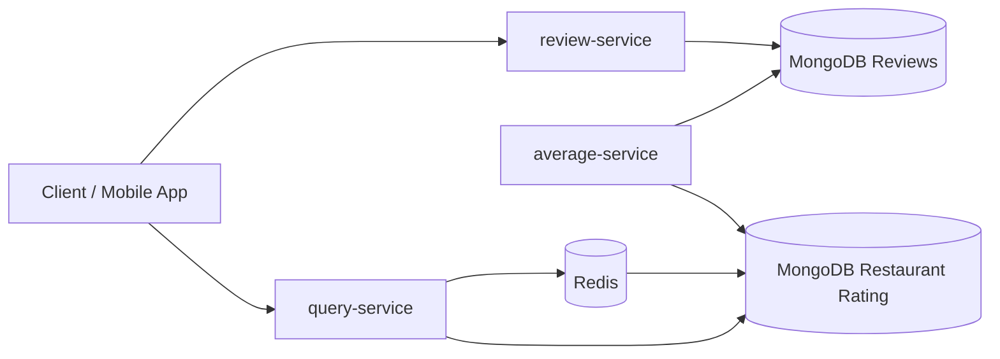
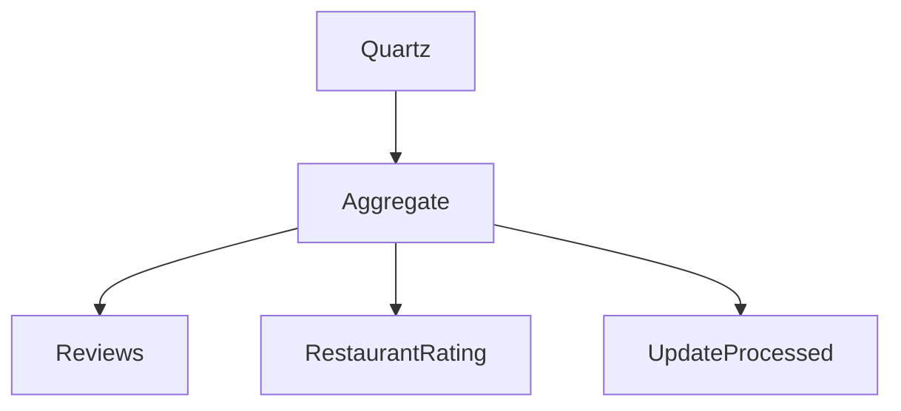

# Survey System


---

# Survey System

Projeto desenvolvido para estudo de arquiteturas modernas de microsserviços utilizando Java, Spring Boot e MongoDB.

O objetivo é simular uma plataforma de avaliações de restaurantes explorando diversos conceitos encontrados em sistemas distribuídos de alta escala, como:

- CQRS
- Cache Aside Pattern
- Redis
- MongoDB
- Quartz Scheduler
- Observabilidade
- Docker
- Testes de carga
- Arquitetura Orientada a Microsserviços

---

# Arquitetura



---

# Fluxo Geral

```text
                     WRITE

          POST /reviews
                 │
                 ▼
         review-service
                 │
                 ▼
        MongoDB (reviews)
                 │
      Quartz Scheduler (daily)
                 │
                 ▼
      average-service
                 │
                 ▼
 MongoDB (restaurant_rating)
                 │
                 ▼
          query-service
         ┌─────────────┐
         │ Cache Aside │
         └─────────────┘
                 │
        ┌────────┴────────┐
        ▼                 ▼
     Redis            MongoDB
```

---

# Funcionalidades

## Review Service

Responsável pelo recebimento das avaliações.

### Recursos

- Cadastro de avaliações
- Persistência no MongoDB
- Índices otimizados
- Micrometer
- Prometheus
- Actuator

Endpoint

```
POST /reviews
```

Exemplo

```bash
curl -X POST http://localhost:8080/reviews \
-H "Content-Type: application/json" \
-d '{
    "orderId":100,
    "restaurantId":1,
    "userId":10,
    "rating":5
}'
```

---

## Average Service

Executa diariamente a consolidação das avaliações.

Responsabilidades

- localizar avaliações pendentes
- agrupar por restaurante
- calcular média
- atualizar coleção consolidada
- marcar avaliações como processadas

Fluxo



---

## Query Service

Responsável exclusivamente pelas consultas.

### Média do restaurante

```
GET /restaurants/{id}
```

Fluxo

```text
Cliente

↓

Redis

↓

Cache Hit?

↓

Sim → Retorna

↓

Não

↓

Mongo

↓

Redis

↓

Cliente
```

### Avaliações do restaurante

```
GET /restaurants/{id}/reviews
```

Características

- paginação
- ordenação por data
- consulta otimizada
- projeções
- MongoTemplate

Exemplo

```
GET /restaurants/100/reviews?page=0&size=5
```

Resposta

```json
{
   "content":[...],
   "pageable":{
      "pageNumber":0,
      "pageSize":5
   },
   "totalElements":30
}
```

---

# Estrutura do Projeto

```
survey-system

├── docs
│   ├── ADR
│   ├── api
│   ├── architecture
│   └── performance.md
│
├── infra
│   ├── docker-compose.yaml
│   ├── mongodb
│   ├── redis
│   ├── kafka
│   └── k8s
│
├── observability
│   ├── prometheus
│   ├── grafana
│   ├── tempo
│   └── loki
│
├── load-tests
│   ├── k6
│   └── gatling
│
├── services
│   ├── review-service
│   ├── average-service
│   └── query-service
│
└── scripts
```

---

# Modelo CQRS

Este projeto utiliza uma implementação simplificada do padrão CQRS.

## Write Model

Coleção

```
reviews
```

Responsável por armazenar todas as avaliações recebidas.

## Read Model

Coleção

```
restaurant_rating
```

Mantém dados previamente consolidados para consultas extremamente rápidas.

---

# MongoDB

## Coleção reviews

Armazena todas as avaliações.

Exemplo

```json
{
   "restaurantId":100,
   "rating":5,
   "createdAt":"..."
}
```

---

## Coleção restaurant_rating

```json
{
   "restaurantId":100,
   "ratingSum":22,
   "totalReviews":5,
   "average":4.40
}
```

---

# Índices

## Reviews

### Idempotência

```java
idx_order_unique
```

Evita duplicidade de pedidos.

---

### Consolidação diária

```java
idx_pending_reviews
```

```
processedAt
createdAt
restaurantId
```

Utilizado pelo Average Service.

---

### Consulta das avaliações

```java
idx_restaurant_recent
```

```
restaurantId
createdAt DESC
```

Otimiza paginação.

---

# Redis

Implementação do padrão

> Cache Aside

Fluxo

```text
Cliente

↓

Redis

↓

Cache Miss

↓

MongoDB

↓

Redis

↓

Cliente
```

TTL atual

```
24 horas
```

Chaves

```
rating:100
rating:101
rating:102
```

---

# Observabilidade

Micrometer

Spring Boot Actuator

Prometheus

Grafana

Atualmente monitoramos

- HTTP Requests
- JVM
- Garbage Collector
- CPU
- Memória
- Threads

---

# Docker

Subindo toda infraestrutura

```bash
docker compose up -d
```

---

# Testes de carga

Ferramentas

- k6
- Gatling

Scripts disponíveis

```
review-post.js

review-post-500.js

review-post-1000.js

review-carga.js
```

---

# ADR

## ADR-001

Uso do MongoDB como banco principal.

## ADR-002

Consolidação diária das avaliações.

---

# Roadmap

## Concluído

- [x] Review Service
- [x] Average Service
- [x] Query Service
- [x] CQRS
- [x] Redis Cache
- [x] MongoDB
- [x] Quartz Scheduler
- [x] Docker Compose
- [x] Prometheus
- [x] Grafana
- [x] Micrometer
- [x] Actuator
- [x] k6
- [x] Paginação
- [x] Índices Mongo

---

## Próximas etapas

- [ ] OpenTelemetry
- [ ] Tempo
- [ ] Loki
- [ ] Dashboard Grafana completo
- [ ] Kubernetes
- [ ] Helm
- [ ] GitHub Actions
- [ ] Deploy AWS
- [ ] Testcontainers
- [ ] Testes de integração
- [ ] Cache Invalidation
- [ ] Cursor Pagination
- [ ] API Gateway

---

# Decisões Arquiteturais

## Por que CQRS?

Separação entre escrita e leitura permite otimizar cada modelo de dados de forma independente.

---

## Por que MongoDB?

As avaliações são documentos independentes, possuem alto volume de escrita e consultas predominantemente por restaurante.

---

## Por que Redis?

Reduz significativamente a latência das consultas mais frequentes, evitando leituras repetidas do banco consolidado.

---

## Por que Quartz?

O requisito funcional permite consistência eventual diária. Um processo agendado simplifica a arquitetura e evita complexidade desnecessária.

---

## Por que não Kafka?

Embora arquiteturas orientadas a eventos sejam comuns em sistemas de grande escala, o cenário atual não exige processamento em tempo real nem múltiplos consumidores.

A utilização de um job de consolidação atende aos requisitos de negócio com menor complexidade operacional.

A arquitetura foi projetada para permitir uma futura evolução para eventos caso novos requisitos demandem atualização em tempo real.

---

# Licença

Projeto desenvolvido para fins de estudo de Arquitetura de Software, Microsserviços e Engenharia de Backend utilizando Java e Spring Boot.
