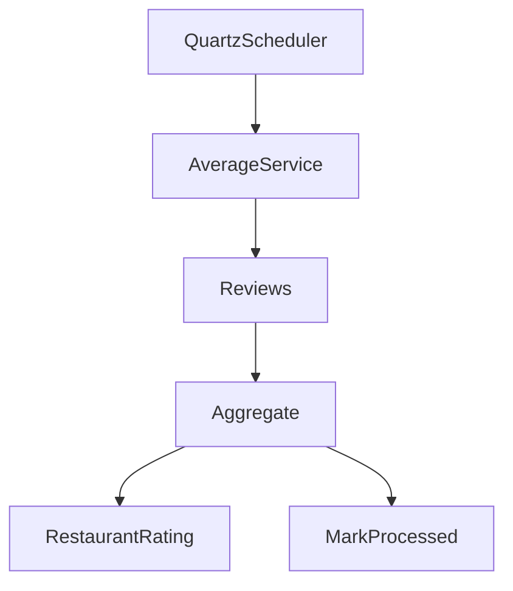

# ADR-002: Daily Aggregation of Restaurant Ratings

- **Status:** Accepted
- **Date:** 2026-07-16
- **Authors:** Adriano Lopes

---

# Context

O Survey System permite que usuários publiquem avaliações de restaurantes.

Cada avaliação é armazenada individualmente na coleção `reviews`.

Uma das principais funcionalidades da aplicação é consultar rapidamente a média das avaliações de um restaurante.

A solução mais simples seria calcular essa média diretamente sobre a coleção `reviews` a cada consulta.

Exemplo:

```javascript
db.reviews.aggregate([
    {
        $match: {
            restaurantId: 100
        }
    },
    {
        $group: {
            _id: "$restaurantId",
            totalReviews: { $sum: 1 },
            ratingSum: { $sum: "$rating" },
            average: { $avg: "$rating" }
        }
    }
])
```

Entretanto, essa abordagem apresenta um custo crescente conforme o número de avaliações aumenta.

---

# Problem

Como disponibilizar consultas rápidas da média de avaliações sem executar agregações sobre milhões de documentos a cada requisição?

Os requisitos do sistema são:

- Alta performance nas consultas.
- Grande volume de escrita.
- Consistência eventual é aceitável.
- A média pode ser atualizada diariamente.
- Simplicidade operacional.

---

# Decision

Foi decidido utilizar um processo de consolidação diária das avaliações.

A consolidação é executada pelo **Average Service** através de um Job Quartz.

O processo percorre apenas avaliações ainda não processadas e atualiza uma coleção específica para consultas.

Coleções envolvidas:

```
reviews
```

Write Model

```
restaurant_rating
```

Read Model

---

# Motivation

O principal objetivo é reduzir o custo das consultas.

Sem consolidação, cada consulta executaria um Aggregation Pipeline sobre a coleção de avaliações.

Com a consolidação, a consulta passa a ser apenas:

```text
findById(restaurantId)
```

Essa operação possui custo praticamente constante.

---

# Aggregation Flow



---

# Processing Strategy

O processamento ocorre diariamente.

Fluxo:

1. Recupera a última data processada.
2. Define o período que deverá ser consolidado.
3. Busca apenas avaliações ainda não processadas.
4. Agrupa por restaurante.
5. Calcula:
   - quantidade de avaliações
   - soma das notas
   - média
6. Atualiza a coleção `restaurant_rating`.
7. Marca as avaliações como processadas.
8. Atualiza o controle da agregação.

---

# Aggregation Control

A coleção `aggregation_control` mantém o estado da execução.

Exemplo:

```json
{
    "_id": "restaurant-average",
    "lastProcessedDate": "2026-07-08",
    "status": "SUCCESS",
    "updatedAt": "2026-07-09T23:47:00Z"
}
```

Essa coleção garante que o processo seja incremental.

---

# Why Incremental Processing?

Suponha que existam:

```
100 milhões
```

de avaliações.

Se a média fosse recalculada diariamente para todos os documentos, o custo seria extremamente elevado.

Com processamento incremental, apenas novos registros são processados.

Exemplo:

```
Dia 1

10 milhões de avaliações
```

```
Dia 2

+15 mil avaliações
```

A consolidação do segundo dia processará somente:

```
15 mil
```

e não os 10 milhões anteriores.

---

# Read Model

Após a consolidação, a coleção `restaurant_rating` contém dados prontos para consulta.

Exemplo:

```json
{
    "restaurantId": 100,
    "ratingSum": 22,
    "totalReviews": 5,
    "average": 4.40,
    "lastProcessedDate": "2026-07-08"
}
```

O Query Service consulta diretamente essa coleção.

---

# Cache Layer

O Query Service utiliza Redis sobre o Read Model.

Fluxo:

```text
Client

↓

Redis

↓

Cache Hit?

↓

Yes → Response

↓

No

↓

MongoDB (restaurant_rating)

↓

Redis

↓

Response
```

Essa estratégia elimina consultas repetidas ao banco.

---

# Alternatives Considered

## Real-Time Aggregation

Cada nova avaliação atualizaria imediatamente a média do restaurante.

### Vantagens

- Dados sempre atualizados.

### Desvantagens

- Maior acoplamento.
- Atualizações concorrentes.
- Necessidade de sincronização.
- Maior custo em escrita.

---

## Aggregation on Read

Executar um Aggregation Pipeline para cada consulta.

### Vantagens

- Implementação simples.
- Nenhum processo batch.

### Desvantagens

- Consultas lentas.
- Escalabilidade limitada.
- Alto consumo de CPU.
- Crescimento proporcional ao volume de dados.

---

## Event-Driven Aggregation (Kafka)

Publicar um evento para cada avaliação criada.

```
ReviewCreated

↓

Kafka

↓

Average Consumer
```

### Vantagens

- Atualização quase em tempo real.
- Arquitetura desacoplada.
- Fácil expansão para múltiplos consumidores.

### Desvantagens

- Maior complexidade operacional.
- Necessidade de infraestrutura adicional.
- Não agrega valor significativo ao cenário atual.

Como o requisito funcional permite atualização diária, Kafka foi considerado desnecessário neste momento.

A arquitetura foi desenhada para permitir essa evolução futuramente.

---

# Trade-offs

A solução adotada privilegia simplicidade.

Aceitamos uma pequena defasagem temporal dos dados em troca de:

- consultas muito rápidas;
- menor consumo de CPU;
- menor carga no banco;
- arquitetura mais simples.

---

# Consequences

## Positivas

- Excelente desempenho nas consultas.
- Leitura com custo constante.
- Processo incremental.
- Escalabilidade.
- Baixo consumo de recursos.
- Fácil monitoramento.

---

## Negativas

- Consistência eventual.
- Necessidade de Job Scheduler.
- Necessidade de coleção auxiliar.
- Pequena complexidade adicional na escrita do Read Model.

---

# Related Components

- Review Service
- Average Service
- Query Service
- MongoDB
- Redis
- Quartz Scheduler

---

# Future Evolution

Caso os requisitos mudem para atualização em tempo real, esta arquitetura poderá evoluir para um modelo orientado a eventos.

Fluxo futuro:

```text
POST /reviews

↓

ReviewCreated Event

↓

Kafka

↓

Average Service

↓

restaurant_rating

↓

Redis Invalidation
```

Essa evolução preserva a separação entre Write Model e Read Model e reduz o tempo entre a criação de uma avaliação e sua disponibilização para consulta.

---

# References

- CQRS Pattern — Martin Fowler
- Building Microservices — Sam Newman
- MongoDB Aggregation Framework
- Quartz Scheduler Documentation
- Redis Cache Aside Pattern